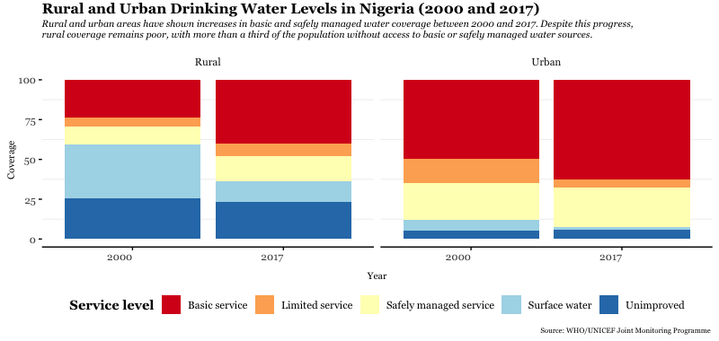
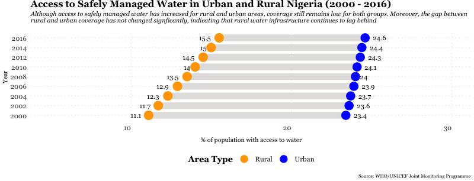
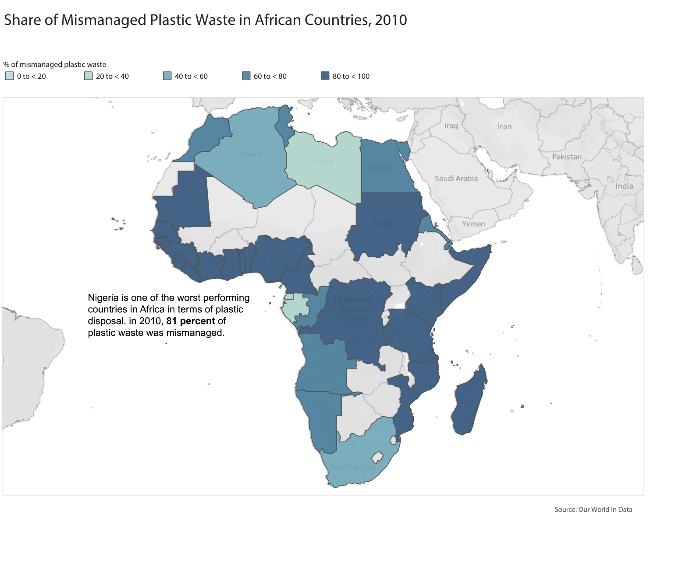

# Public Water Access in Nigeria and its Effects on the Environment

Water is an important resource. It would be difficult or even impossible to complete important daily activities (eg, bathing, cooking, washing) without water. This makes water access a relevant public issue. According to the World Health Organization, the most ideal water sources should be located close, available when needed, and free from contamination [^1]. Unfortunately, in Nigeria, access to this quality of water is poor because government water provision is lacking in many areas. This leaves many with no choice but to use water from unprotected, unregulated sources. 

This lack of coverage is exacerbated when we consider rural areas: more than a third of the rural population only has access to limited , unimproved  or surface water  sources. This includes unregulated aquifers, wells and streams. Research shows that although there have been improvements in access to safe water sources, rural coverage still lags behind. For example, in 2017, while only 1.8% of urban residents used surface water like streams as their primary source of drinking water, this was almost 13% in rural areas. This has translated to adverse effects on health; for example, diarrhea, a gastrointestinal disease usually caused by drinking contaminated water, is responsible for 150,000 annually in Nigeria . Rural residents, who lack access to safe water facilities, are more at risk of contracting diarrhea due to contaminated water.

Despite these dire indicators, some effort has been made to bridge the urban-rural infrastructure gap; for example, data shows that rural coverage of safely managed water has steadily increased since 2000 while urban coverage has remained largely unchanged. This points to targeted effort to increase access to basic amenities in rural areas. However, it is important to note that safe water coverage is still very low for both urban and rural residents. In 2016, less than a quarter of rural and urban residents had access to safely managed water. This is even worse in densely populated areas. For example, in Lagos, Nigeria’s most populous city, only 1 in 10 people have access to state provided water . Most people either drill for water on their property or buy water from vendors. Although these sources are usually safer than drinking from surface water, they also carry their own risks because they are untested sources of water. 

The lack of publicly available water has implications for the environment. Poor access to public water coupled with mistrust in its quality have led consumers to depend on water provided by the private market. This has led to an increase in plastic consumption as many private companies sell their water in plastic containers. Research shows the number of plastic bottles used has doubled in the past three years, reaching approximately 150,000 metric tons annually . Unfortunately, this has led to an increase in plastic pollution due to inadequate recycling facilities. Most of this waste ends up in in dumps or waterways, which result in toxins polluting water and drainage of waterways. 

In conclusion, the Nigerian government must make a conscientious effort to increase access to water, especially in rural areas. Research has shown that the health and environmental consequences of water shortage are too important to ignore.

[^1]: https://washdata.org/monitoring/drinking-water
[^2]: Drinking water from an improved source for which collection time exceeds 30 minutes for a roundtrip including queuing
[^3]: Drinking water from an unprotected dug well or unprotected spring
[^4]: Drinking water directly from a river, dam, lake, pond, stream, canal or irrigation canal

  

